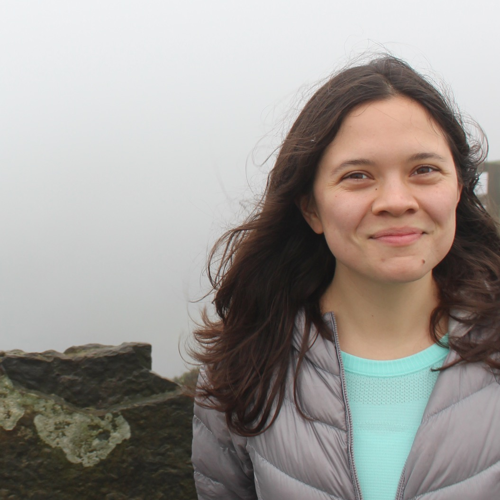

I'm a machine learning researcher focusing specializing on the empirical study of deep learning models to improve their reliability in high stakes domains such as healthcare.
At Brown University, I work with my PhD advisor, [Michael Littman](http://cs.brown.edu/~mlittman/),  studying the inductive bias of overparamterized models.  For the past two summers, I have collaborated with [Michela Paganini](https://mickypaganini.github.io/) at [Facebook AI Research](https://ai.facebook.com/) on model pruning.  Prior to starting my PhD, I was an active core maintainer at [Project Jupyter](https://jupyter.org/), which maintains open source projects such as the [Jupyter Notebook](https://github.com/jupyter/notebook).  I also worked as a Data Scientist, collaborating with colleagues at organizations such as McKinsey and DARPA.   

I believe that the open science movement is important to improving transparency and accountability in machine learning. At [Project Jupyter](https://jupyter.org/) I co-maintained reproducibility tools such as [binder](https://mybinder.org) and [repo2docker](https://repo2docker.readthedocs.io/en/latest/).  I also am a co-organizer of the [Machine Learning Reproducibility Challenge](https://reproducibility-challenge.github.io/neurips2019/) and [Machine Learning Retrospectives](https://ml-retrospectives.github.io/).  This fall, I will also be co-organizing a [NeurIPS](https://neurips.cc) workshop on negative results in probabilistic machine learning, [I Can't Believe It's Not Better!](https://neurips.cc/Conferences/2020/Schedule?showEvent=16124)

Email me at jessica_forde at brown.edu.  

Fun Fact: My [Project Jupyter code](https://jupyter.org/) is in the [GitHub Arctic Code Vault](https://archiveprogram.github.com/), 250 meters underground in a former coal mine in Svalbard, Norway.

## Selected Publications

1. Paganini M, Forde JZ. [Bespoke vs. Prêt-à-Porter Lottery Tickets: Exploiting Mask Similarity for Trainable Sub-Network Finding]( http://arxiv.org/abs/2007.04091). 2020.
2. Paganini M, Forde JZ. [dagger: A Python Framework for Reproducible Machine Learning Experiment Orchestration](http://arxiv.org/abs/2006.07484). 2020.
3. Paganini M, Forde J. [Streamlining Tensor and Network Pruning in PyTorch](http://arxiv.org/abs/2004.13770). ML for Developing Countries Workshop, ICLR 2020. *Contributed Talk.*
4. Paganini M, Forde J. [On Iterative Neural Network Pruning, Reinitialization, and the Similarity of Masks](http://arxiv.org/abs/2001.05050). ML for Developing Countries Workshop, ICLR 2020.
5. Zech JR, Forde JZ, Littman ML. [Individual predictions matter: Assessing the effect of data ordering in training fine-tuned CNNs for medical imaging](http://arxiv.org/abs/1912.03606). ML for Healthcare Workshop, NeurIPS 2019.
6. Forde JZ, Paganini M. [The scientific method in the science of machine learning](http://arxiv.org/abs/1904.10922). ML for Healthcare Workshop, NeurIPS 2019.
7. Forde J, Bussonnier M, Fortin F-A, Granger B, Head T, Holdgraf C, et al. [Reproducing Machine Learning Research on Binder](https://openreview.net/pdf?id=BJlR6KTE3X). 2018.
8. Project Jupyter, M. Bussonnier, J. Forde, J. Freeman, B. Granger, T. Head, C. Holdgraf, K. Kelley, G. Nalvarte, A. Osheroff,M. Pacer, Y. Panda, F. Perez, B. Ragan-Kelley, and C. Willing. [Binder 2.0-Reproducible, interactive, sharable environments for science at scale](https://conference.scipy.org/proceedings/scipy2018/project_jupyter.html). Scipy. 2018.
