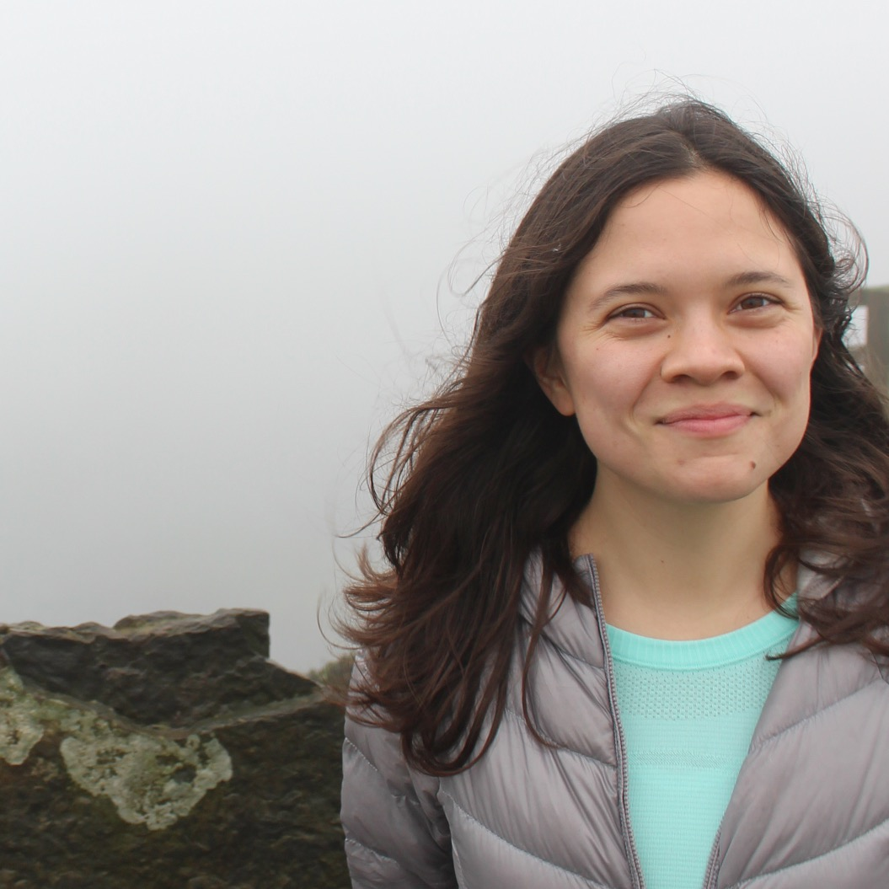

I'm a PhD candidate in the computer science department at Brown University studying the evaluation of AI systems, with an emphasis on real world settings. Prior to starting my PhD, I was a data scientist working with organizations such as DARPA and McKinsey, and a open source core-maintainer at [Project Jupyter](https://jupyter.org/). My work evaluating large multilingual-language models has received the [Mozilla Technology Fund 2023 Award](https://foundation.mozilla.org/en/blog/evaluation-harness-is-setting-the-benchmark-for-auditing-large-language-models/) and has also been covered in [WIRED magazine](https://www.wired.com/story/chatgpt-non-english-languages-ai-revolution/).

Email me at jessica_forde at brown.edu.  

## News 

- Our initial paper, [Re-Evaluating Evaluation for Multilingual Summarization](https://aclanthology.org/2024.emnlp-main.1085/), as part of our [Mozilla Technology Fund 2023 Award](https://foundation.mozilla.org/en/blog/auditing-ai-announcing-the-2023-mozilla-technology-fund-cohort/) was recently presented at EMNLP in Miami 🌴. 

- I was honored to be invited by [US State Deptartment](https://nz.usembassy.gov/ai-experts-jessica-and-james-pavur-visit-to-nz/) to visit New Zealand and Australia as part of their US Speakers program.

## Selected Publications

1. Forde JZ*, Zhang R*, Sutawika L, Aji AF, Cahyawijaya S, Winata GI, Wu, M., Eickhoff, C., Biderman, S., & Pavlick, E. [Re-Evaluating Evaluation for Multilingual Summarization](https://aclanthology.org/2024.emnlp-main.1085/). EMNLP. 2024. 
2. Yong ZX, Zhang R, Forde J, Wang S, Subramonian A, Lovenia H, Cahyawijaya, S., Winata, G. I., Sutawika*, L., Cruz, J. C. B., Tan, Y. L., Phan, L., Garcia, R., Solorio, T., & Aji, A. F. [Prompting Multilingual Large Language Models to Generate Code-Mixed Texts: The Case of South East Asian Languages](https://aclanthology.org/2023.calcs-1.5/). Proceedings of the 6th Workshop on Computational Approaches to Linguistic Code-Switching. 2023.
3. Lovering C*, Forde J*, Konidaris G, Pavlick E, Littman M. [Evaluation beyond task performance: Analyzing concepts in AlphaZero in Hex](https://proceedings.neurips.cc/paper_files/paper/2022/hash/a705747417d32ebf1916169e1a442274-Abstract-Conference.html). NeurIPS. 2022.  
4. Cooper AF, Lu Y, Forde JZ, De Sa C. [Hyperparameter Optimization Is Deceiving Us, and How to Stop It.](https://arxiv.org/abs/2102.03034) NeurIPS. 2021.
5. Forde JZ\*, Cooper AF\*, Kwegyir-Aggrey K, De Sa C, Littman M. [Model Selection's Disparate Impact in Real-World Deep Learning Applications.](model_selection_disparate_impact.pdf) Science and Engineering of Deep Learning Workshop, ICLR 2021. *Contributed Talk.*
6. Paganini M, Forde J. [Streamlining Tensor and Network Pruning in PyTorch](http://arxiv.org/abs/2004.13770). ML for Developing Countries Workshop, ICLR 2020. *Contributed Talk.*
7. Zech JR, Forde JZ, Littman ML. [Individual predictions matter: Assessing the effect of data ordering in training fine-tuned CNNs for medical imaging](http://arxiv.org/abs/1912.03606). ML for Healthcare Workshop, NeurIPS 2019.
8. Forde JZ, Paganini M. [The scientific method in the science of machine learning](http://arxiv.org/abs/1904.10922). Debugging Machine Learning Models Workshop, ICLR 2019. *Contributed Talk*
9. Project Jupyter, M. Bussonnier, J. Forde, J. Freeman, B. Granger, T. Head, C. Holdgraf, K. Kelley, G. Nalvarte, A. Osheroff,M. Pacer, Y. Panda, F. Perez, B. Ragan-Kelley, and C. Willing. [Binder 2.0-Reproducible, interactive, sharable environments for science at scale](https://conference.scipy.org/proceedings/scipy2018/project_jupyter.html). Scipy. 2018.
